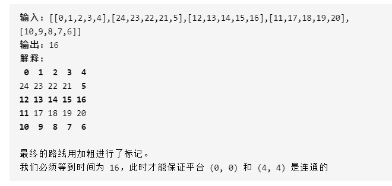
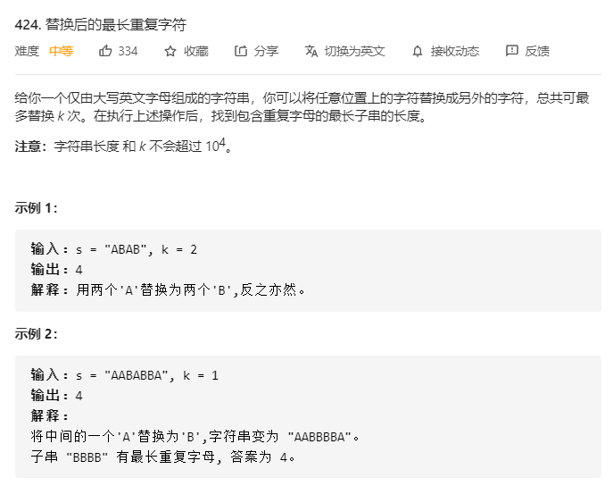
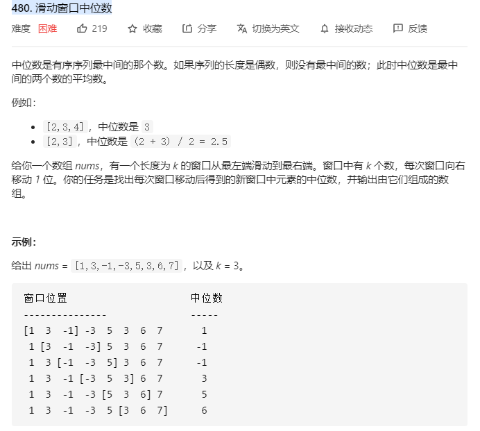
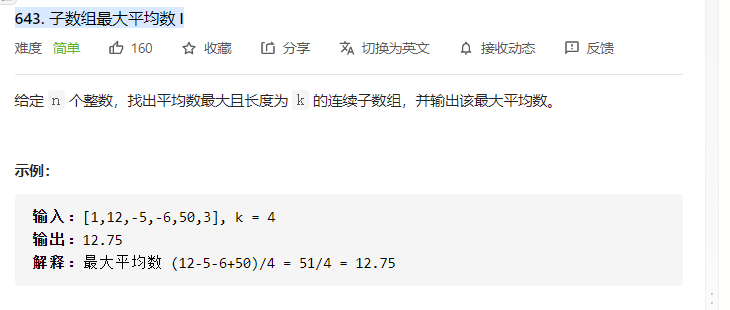
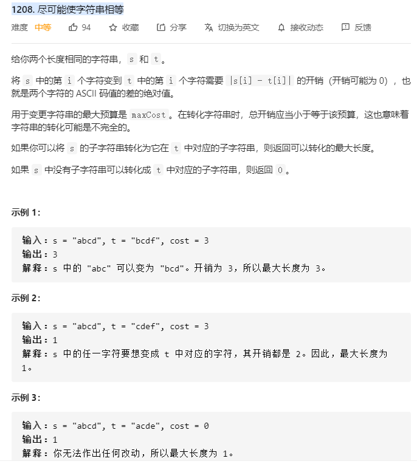

# leetcode
<font color="red">所有的代码在leetcode文件夹里面，如leetcode 33题，则是namespace lt33命名</font>

## 1631. 最小体力消耗路径

[link](https://leetcode-cn.com/problems/path-with-minimum-effort/)

感觉这个题目我一看到第一反应应该是dp，后来建立不出来dp，就想搜索，搜索一想代价就很大，会走一些没用的路肯定不好过。

**a*算法**

a*的核心思想在于启发式函数h(x)+g(x)的过程。总是朝着当前最优的地方寻址。这个题目就是h(x)=0的情况，所以就是一个最小路径求解算法。

**并查集**

这个题目感觉好难啊，没想到，看了题解之后才能做，其实你看了之后发现这个题目核心2点。

1. 对所有的边进行排序
2. 将边一个一个放进去，找到连通性，我tm直接裂开。

今天学习他代码发现一个好东西，就是多一个size，那样的话，不需要递归回去修改，只需要把一个人的root进行修改即可。

## 778. 水位上升的泳池中游泳
[link](https://leetcode-cn.com/problems/swim-in-rising-water/)

这个题目和昨天的题目类似，昨天是求差值，而今天得题目就是max就行了。

**并查集**

2个点，之间必须满足最大值才能进行游动，所以保证一个方向下，求最大值才能保持可行，不需要想象他下雨的过程，只需要保证下雨的结果，也就是到达能通行的结果储存进数值进行排序储存，里面必须有2个点以及value。然后通过不断地放value就能得到这个结果。



这个的放的过程就是
1 2 3 4 7 8 9 10 11 12 13 14 15 16.

然后就是检查连通性。

## 839. 相似字符串组

[link](https://leetcode-cn.com/problems/similar-string-groups/)

我开始题目意思理解错了，所以认为直接排序即可。

**并查集**
整体的逻辑就是，如果2个是相似的就union。

而相似的逻辑就是长度首先相同，然后字符只有2个不同或者0个不同。

## 888. 公平的糖果棒交换

**hash**
2个人储存的糖果如果有差别，那么suma和sumb。那么差值c=suma-sumb。而我们要做的是把c=c/2也就是各自的差值补齐，那么c+sumb=suma。

## 424. 替换后的最长重复字符

[link](https://leetcode-cn.com/problems/longest-repeating-character-replacement/)



**双指针**

今天又是看题解的一天...

这里维护的窗口内字符重复最大的作为maxcount。如果i-left+1比maxcount+k数目少一点。那就说明可以往右边移动，如果此时已经大于了，那就说明是已经不行了，要开始往left++的移动。直到找到下一个值继续往右移动。

```c++
int characterReplacement(string s, int k) {
        vector<int> num(26);
        int n = s.length();
        int maxn = 0;
        int left = 0, right = 0;
        while (right < n) {
            num[s[right] - 'A']++;
            maxn = max(maxn, num[s[right] - 'A']);
            if (right - left + 1 - maxn > k) {
                num[s[left] - 'A']--;
                left++;
            }
            right++;
        }
        return right - left;
    }

作者：LeetCode-Solution
链接：https://leetcode-cn.com/problems/longest-repeating-character-replacement/solution/ti-huan-hou-de-zui-chang-zhong-fu-zi-fu-n6aza/
来源：力扣（LeetCode）
著作权归作者所有。商业转载请联系作者获得授权，非商业转载请注明出处
```
官方题解更加难懂，他这里的right-left为啥最大如果没仔细读根本读不懂，他这里的left最差的情况下是和right一起加，所以一旦锁定了一个最大，那么他后面left和right只会一起增加，除非另外一个maxcount出现。也就是right-left+1-maxn<=k的情况出现，那说明maxn很大，可以继续填充k。

## 480. 滑动窗口中位数


这个题目可以直接维护一个整体队列来进行二分的插入或者查找。然后维护一个删除和增加操作即可。但是我看了官方题解之后觉得它的方法更加的优秀直接维护2个队列即可，一个最大一个最小。直接log2，然后就出问题了。我把他的动作分解为插入，删除，平衡，返回。感觉很有道理，不过遇到了一个1000个数字的，我根本没办法进行错误调试，今天不早了睡了，改天在调试。


## 643. 子数组最大平均数 I


滑动窗口，头减去尾部加上，打卡下班。明天见

## 1208. 尽可能使字符串相等


这个题目的意思读懂我花了好久，我以为是要匹配字串然后在比较能否转化，它的意思是直接转化连续的字串，这样一个双指针，如果够right就往后面跑之前先maxcos-spend[right]，不够left就往后面跑之前先Maxcos-spend[left]，如果left==right所以2个一起跑路。其实没必要spend数组，我只是懒得管理代码就这么写了。